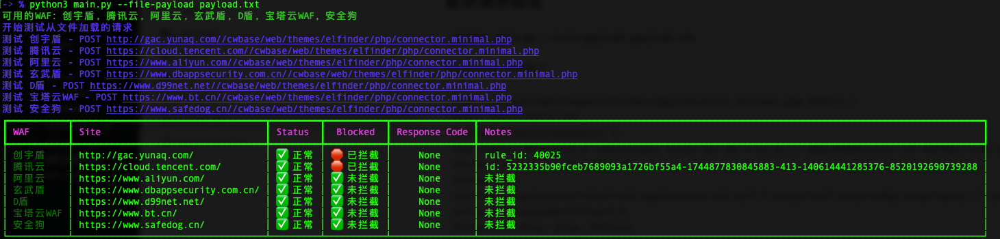

# WAF Payload 拦截测试器

这是一个用于测试不同 WAF (Web Application Firewall) 对 payload 拦截情况的工具。支持创宇盾、腾讯云、阿里云、玄武盾、宝塔云WAF、D盾、安全狗、奇安信网站卫士、长亭雷池WAF等多种 WAF。

## 功能特点

- 支持简单的 URL 请求验证（URL 链接中包含敏感 payload）
- 支持复杂的请求验证（POST、PUT、DELETE 等有数据包的请求）
- 支持在终端以表格形式展示测试结果
- 支持指定特定的防火墙进行验证
- 支持在防火墙拦截的情况下获取拦截页面信息
- 支持自确认模式，验证当前 WAF 的状态是否正常

## TODO功能

- 新增--cve-payload选项，支持直接指定CVE编号自动验证POC/EXP是否拦截（已完成）
- 新增--link-payload选项，支持指定漏洞分析/漏洞情报/漏洞详情网页地址自动验证POC/EXP是否拦截
- 新增--ai-payload选项，支持自然语言描述漏洞信息自动验证POC/EXP是否拦截

## 安装

```bash
# 克隆仓库
git clone https://github.com/pbuff07/waf_repeater.git
cd waf_repeater

# 安装依赖
pip install -r requirements.txt
```

## 使用

## 自检查

```
python main.py --verify
```

自检查选项会发送对应WAF必拦截的Payload测试站点防护是否在线。


### 简单 URL 验证
```python
python main.py --url-payload "/?filename=/etc/passwd&content=1' union select 1,2,database(),4,5,6,7#"
```


### 复杂请求验证

```python
python main.py --file-payload payload.txt
```

Payload.txt 内容如下：

```
POST //cwbase/web/themes/elfinder/php/connector.minimal.php HTTP/1.1
Host: www.baidu.com
Upgrade-Insecure-Requests: 1
User-Agent: Mozilla/5.0 (Macintosh; Intel Mac OS X 10_15_7) AppleWebKit/537.36 (KHTML, like Gecko) Chrome/104.0.0.0 Safari/537.36
Accept: text/html,application/xhtml+xml,application/xml;q=0.9,image/avif,image/webp,image/apng,*/*;q=0.8,application/signed-exchange;v=b3;q=0.9
Accept-Encoding: gzip, deflate
Accept-Language: zh-CN,zh;q=0.9,en;q=0.8
Cookie: id=4878d749336b447428d5a36114e9bfac
If-None-Match: "62efd223-3"
If-Modified-Since: Sun, 07 Aug 2022 14:54:27 GMT
Connection: close
Content-Type: application/x-www-form-urlencoded
Content-Length: 86

target=l1_%3C@base64%3E/var/www/html/elfinder/files/%3C@/base64%3E&downLoad=1
```



### 根据CVE编号自动验证

> python3 main.py --cve-payload CVE-2025-0868

配置：需要在程序目录下新建tools文件夹并在config/waf_config.py中更新如下配置项目。

注意：下面包含三个类型macos/windows/linux，配置对应自己系统的参数即可。根据下载地址下载对应的引擎和模板压缩包后解压到tools目录下并更新引擎名称和模板文件夹名称到下面CVE_TOOLS_CONFIG中即可。

```
CVE_TOOLS_CONFIG = {
    "nuclei": {
        "path_macos": "tools/[your-nuclei-name]",
        "path_windows": "tools/[your-nuclei-name]",
        "path_linux": "tools/[your-nuclei-name]",
        "templates_path": "tools/[your-nuclei-templates-name]",
    }
}

nuclei引擎下载地址：https://github.com/projectdiscovery/nuclei/releases
nuclei-templates模板下载地址：https://github.com/projectdiscovery/nuclei-templates/releases
```

下图为示例配置：


运行示例截图：


